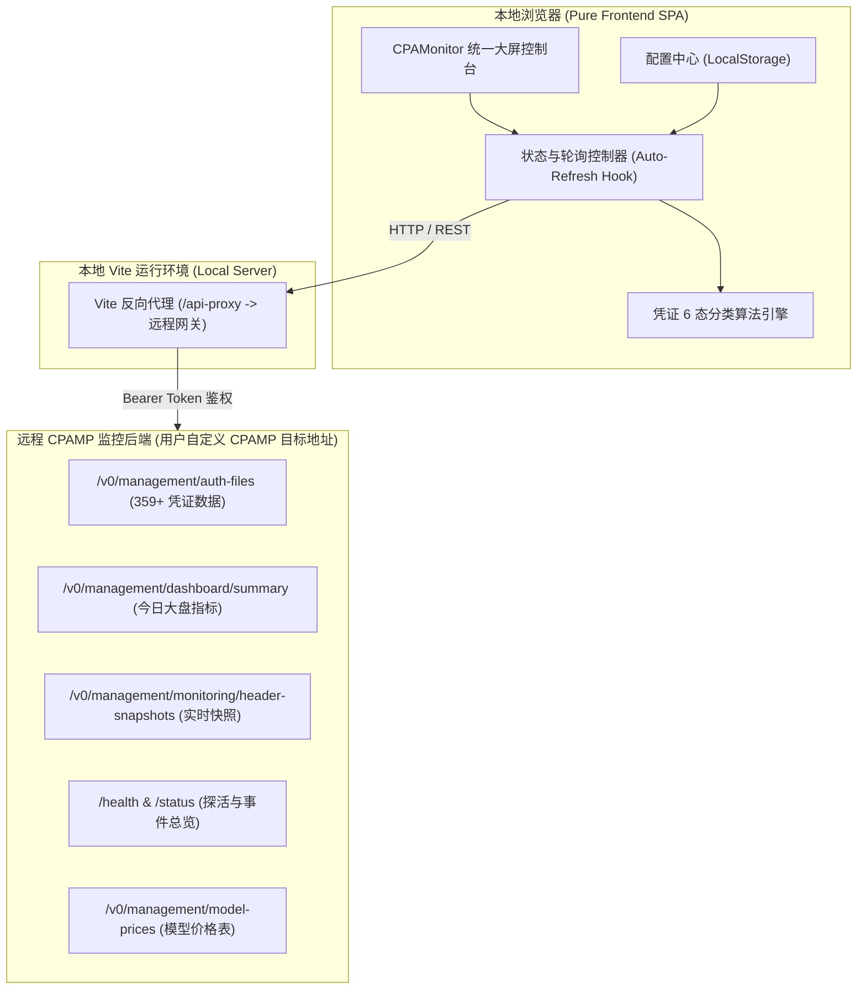

# CPAMonitor 系统架构与设计规范文档

## 一、 项目概述

**CPAMonitor** 是一个面向 AI 代理网关与中转系统的**纯前端、本地运行**的统一聚合监控与凭证管理工作台。

该平台旨在解决多账号、多模型网关运营中的两大核心痛点：
1. **凭证状态全局透视**：直观掌控数百个凭证的健康状态、额度消耗水位与异常告警。
2. **请求链路实时监控**：完整复刻工业级 CPAMP 管理系统（`cpamp`）的请求监控大盘与明细，实现毫秒级调用追踪、QPS 波形分析与模型成本统计。

---

## 二、 核心特性与技术架构

### 1. 技术栈选型
* **核心框架**：React 18 / 19 + TypeScript
* **构建与开发服务器**：Vite（内置高效开发反向代理，彻底解决跨域与 HTTPS 证书问题）
* **样式与 UI 体系**：Tailwind CSS + Lucide Icons（深度复刻 cpamp 暗黑科技工业风，主色调 `#0B0F17` / `#131B2A`）
* **数据可视化图表**：ECharts (echarts-for-react) / Recharts（高刷新率波形图、Token 构成饼图、时序柱状图）
* **数据层与轮询**：Axios + 自研智能轮询机制（支持 5s / 10s / 30s / 手动刷新与倒计时动画）
* **持久化**：`localStorage`（保存 API 端点、密钥、刷新偏好与自定义列配置）

### 2. 运行架构图



---

## 三、 数据源与前端动态配置机制

* **目标服务地址**：由用户在前端设置弹窗（UI）中输入（如 `https://your-cpamp-host:port`），支持任意 CPAMP 实例
* **管理密钥 (Token)**：由用户在前端安全输入，保存在本地浏览器的 `localStorage` 中，代码库内零硬编码
* **鉴权方式**：`Authorization: Bearer <TOKEN>`
* **代理与证书**：本地 Vite 动态反向代理（`/api-proxy`）按请求头动态转发，支持自签名 HTTPS 证书与跨域处理
* **接口映射清单**：
  * `GET /health`：连通性探活检查
  * `GET /status`：采集器运行状态、事件总数与 SQLite 数据库维护指标
  * `GET /v0/management/auth-files`：受管凭证全量清单（含 Quota Signals 与近期请求桶）
  * `GET /v0/management/dashboard/summary?today_start_ms=<MS>`：今日核心流量汇总、时序波形图、热门模型消耗
  * `GET /v0/management/monitoring/header-snapshots`：实时调用快照事件流（包含 Trace ID、耗时、模型、关联凭证与 Header 水位）
  * `GET /v0/management/model-prices`：模型计费标准库（用于计算 Token 成本）

---

## 四、 凭证管理 6 态分类规范

凭证状态卡片精确实现以下 6 种状态的计算与联动筛选：

| 状态名称 | 预期基准值 | 状态定义与业务含义 | 判定算法逻辑 | 界面视觉色彩 |
| :--- | :---: | :--- | :--- | :--- |
| **总凭证** | **359** | 全部受管凭证 | `authFiles.length` | 科技蓝 (`#3B82F6`) |
| **正常可用** | **8** | 已确认健康且可用 | `!disabled` 且 `status === 'active'` 且无异常报错，主额度使用率 $< 80\%$ | 荧光绿 (`#10B981`) |
| **需要处理** | **0** | 重新认证、异常或待处理操作 | 出现 401 认证失效、`status_message` 包含报错、或标记需人工介入 | 告警红 (`#EF4444`) |
| **额度风险** | **1** | 低额度、部分可用、已耗尽或冷却中 | 主额度使用率 $\ge 80\%$（如使用率 91%）、处于重置冷却期或额度耗尽 | 琥珀橙 (`#F59E0B`) |
| **已禁用** | **350** | 当前禁用的凭证 | `disabled === true` 或 `status === 'disabled'` | 中性灰 (`#6B7280`) |
| **状态待确认** | **0** | 缺少可用的健康或额度证据 | 缺少近期请求记录且无健康/额度观测证据 | 渐变紫 (`#8B5CF6`) |

> **联动特性**：点击上方任一状态卡片，可直接过滤下方凭证表格或请求明细中的对应凭证集合。

---

## 五、 请求监控页面结构（复刻 cpamp）

页面结构由「顶层指标栏」+「四维度工作台 Tab」组成：

### 1. 顶层核心 KPI 监控栏
* **今日总调用量 & 成功率**：如 `1,553 次` (`99.61%`)
* **Token 吞吐量**：如 `216.46M Tokens`（细分：Prompt / Completion / Cache Read / Reasoning）
* **平均耗时 & P95**：如 `Avg 16.08s`
* **预估总成本 & 失败调用**：如 `$17.67` / `6 次失败`

### 2. 工作区四大 Tab

#### 📊 Tab 1: 监控大盘与趋势分析 (Dashboard & Analytics)
* **24 小时请求与 QPS 趋势图**：基于 `traffic_timeline` 绘制成功/失败面积时序波形。
* **Token 消耗构成 (Token Mix)**：环形比例图展示 Input、Output、Cache Read 与 Reasoning Token。
* **Top 热门模型榜**：按调用量/Token/费用展示排行（如 `gpt-5.6-luna`）。
* **最近异常请求快讯**：实时列出最近 5 次失败调用的时间、模型、状态码与错误信息。

#### ⚡ Tab 3: 实时请求明细 (Real-time Events Stream)
* **数据结构**：基于 `header-snapshots` 实时展示请求记录。
* **字段展示**：
  * **时间戳**（精确到秒）
  * **请求模型 / 实际解析模型**
  * **供应商 Provider**（Codex / Claude / Gemini / OpenAI）
  * **分配凭证 / 账号快照**
  * **状态码 Badge**（`200 OK` 绿标、`429` 橙标、`500` 红标）
  * **响应延迟 Latency (ms)**
  * **Token 消耗**
  * **Trace ID**
* **行点击交互**：弹出「请求元数据与 Header 诊断详情抽屉」，可一键复制 cURL 和 Trace ID。

#### 🔑 Tab 3: 凭证管理工作台 (Credential Workspace)
* 与顶部 6 态指标无缝联动的全量凭证数据表。
* 包含凭证名称、Provider、套餐类型（Free/Pro/Team）、状态、额度水位百分比条、最近请求微波形图（Sparkline）。
* 支持快速搜索、复制 Auth Index、查看 Quota Signals 原始 JSON。

#### 📈 Tab 4: 账户与模型维度统计 (Aggregation Breakdown)
* **账户维度**：汇总各凭证分担的调用总数、Token 产出、成功率与平均耗时。
* **模型维度**：汇总各模型的调用频次、Token 消耗占比与错误分布。

---

## 六、 工程目录规范 (`CPAMonitor`)

```
CPAMonitor/
├── DESIGN.md                  # 本设计规范文档
├── LICENSE                    # MIT 开源许可证
├── README.md                  # 详细使用与说明文档
├── .gitignore                 # Git 忽略规则
├── package.json               # 根目录便捷转发脚本
└── web/                       # 前端工程源码目录
    ├── index.html             # 入口 HTML
    ├── package.json           # 依赖管理配置
    ├── vite.config.ts         # Vite 配置（含动态反向代理）
    ├── tsconfig.json          # TypeScript 编译配置
    ├── tailwind.config.js     # Tailwind 样式配置
    ├── postcss.config.js
    └── src/
        ├── main.tsx           # 应用入口
        ├── App.tsx            # 根应用组件与布局壳
        ├── types/             # 类型定义 (auth/monitoring/dashboard)
        ├── services/          # API 客户端与 6 态分类算法
        ├── hooks/             # 轮询与数据聚合 Hooks
        ├── components/        # 模块化 UI 组件
        └── styles/            # 暗黑科技工业主题全局样式
```

---

## 七、 启动与运行指南

### 本地开发运行
```bash
cd /home/wang/codes/zz/CPAMonitor
npm run dev
# 或进入 web 目录
cd web && npm run dev
```
打开浏览器访问 `http://localhost:5217` 即可实时查看监控大盘。

### 生产静态构建
```bash
npm run build
# 构建输出至 web/dist/ 目录，可直接用任何静态 Web 服务器托管
```
