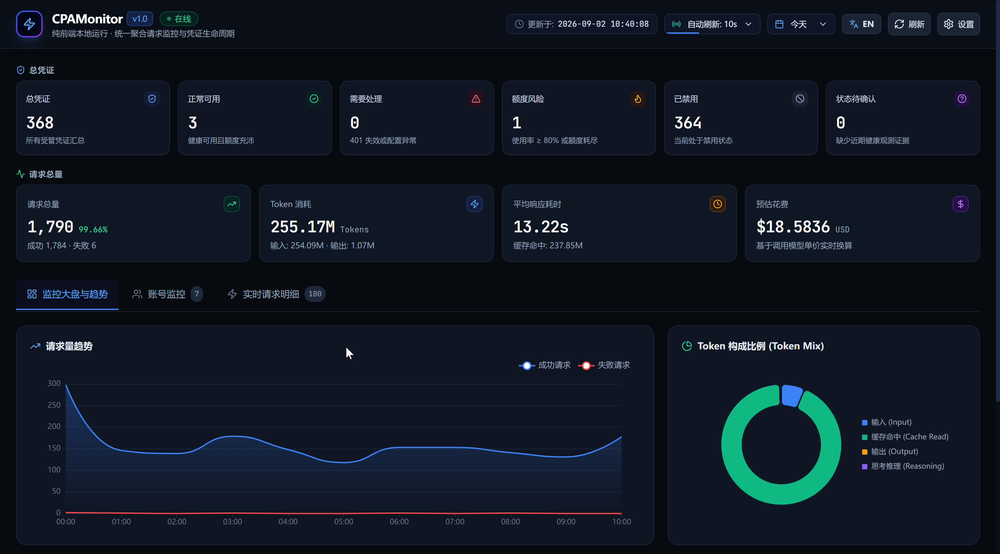
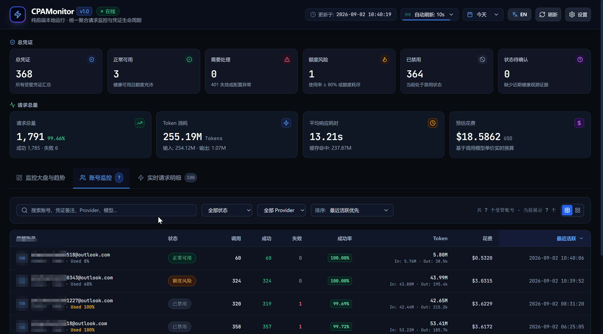
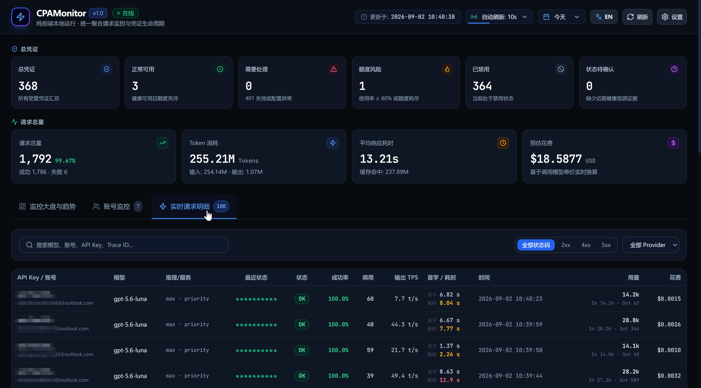

# CPAMonitor ⚡

> **纯前端 · 本地运行 · 开箱即用**
> 聚合「AI 网关请求链路监控」与「受管凭证账号生命周期」的统一大屏工作台。

[](LICENSE)
[](https://react.dev/)
[](https://www.typescriptlang.org/)
[](https://vitejs.dev/)
[](https://tailwindcss.com/)

---

## 🌟 核心特性

### 1. 🛡️ 凭证 6 态聚合看板（支持点击联动筛选）
精确计算并实时聚合受管凭证的健康状态与额度水位：
- 🔵 **总凭证**：全部受管凭证总览。
- 🟢 **正常可用**：已确认健康可用，额度充沛且服务正常。
- 🔴 **需要处理**：401 认证失效、异常报错或需人工介入。
- 🟠 **额度风险**：低额度、部分可用、已耗尽或冷却中（如使用率 $\ge 80\%$ 的账号）。
- ⚪ **已禁用**：当前处于禁用状态的账号。
- 🟣 **状态待确认**：缺少近期健康或额度观测证据的新增凭证。

> 💡 **交互特性**：点击上方任意状态卡片，下方账号监控工作台立即联动进行对应状态账号过滤。

---

### 2. ⚡ 请求监控三大核心工作区（复刻 cpamp 架构）

1. **📊 监控大盘与趋势分析 (Dashboard & Trends - 首选默认)**：
   - **24h 流量与 QPS 时序波形图**：成功与失败调用的平滑面积时序图。
   - **Token 构成比例图 (Token Mix)**：Input、Output、Cache Read 与 Reasoning Token 环形占比。
   - **热门模型排行榜**：Top Models 每日调用量、Token 吞吐、预估成本与成功率。
   - **网关运行与存储指标**：SQLite 数据库大小、WAL 字节数与事件采集器状态。
   - **最近失败快讯**：发生错误状态码、模型与详细错误信息。



2. **👥 账号监控与消耗工作台 (Account Monitoring)**：
   - **全量核心指标列**：账号名称/邮箱、状态、总调用量、成功数、失败数、成功率、总 Token 消耗（支持 In/Out/Cached 悬浮明细）、花费金额、最近请求时间（`YYYY-MM-DD HH:mm:ss`）。
   - **cpamp 标准多字段排序**：默认按最近活跃时间（`lastSeenAt`）降序排序，支持点击任意表头在升序与降序之间快速切换，带多级回退同值仲裁算法。
   - **双视图与明细抽屉**：支持表格视图与卡片视图切换，点击单行弹出账号诊断抽屉。



3. **⚡ 实时请求明细 (Real-time Events Stream)**：
   - 实时加载调用快照流，显示精确到秒的请求时间、HTTP 状态码 Badge、模型、命中凭证账号、响应延迟与 Trace ID。
   - 点击任意行即可弹出 **Header 快照与请求元数据诊断抽屉**。



---

### 3. 🔒 纯前端动态配置与安全
- **零代码硬编码**：代码库中不包含任何预设服务端点与密钥，彻底避免敏感信息泄露。
- **首次使用一键配置**：首次访问界面会自动弹出「服务与鉴权设置」窗口，用户在 UI 界面输入 CPAMP 服务地址（如 `https://your-cpamp-domain:port`）与管理密钥（Token）。
- **本地存储持久化**：配置通过 `localStorage` 安全持久化于当前浏览器，支持一键连通性测试。
- **智能自动轮询**：支持 5s / 10s / 30s 自动倒计时刷新与一键手动立即同步。
- **动态反向代理**：内置 Vite 动态反向代理（`/api-proxy`），根据请求头动态转发，解决跨域（CORS）与 HTTPS 自签名证书阻拦问题。

---

## 🚀 快速开始

### 1. 启动方式

#### 方式 A：直接在根目录启动
```bash
npm run dev
```

#### 方式 B：进入 `web` 目录启动
```bash
cd web
npm install
npm run dev
```

启动后在浏览器打开：
* 本地访问：[**`http://localhost:5217`**](http://localhost:5217) 或 [**`http://127.0.0.1:5217`**](http://127.0.0.1:5217)

> 🐧 **WSL2 用户提示**：服务已默认监听在 `0.0.0.0`，在 Windows 宿主机浏览器直接访问 `http://localhost:5217` 即可正常访问。

### 2. 首次使用配置
在浏览器打开页面后：
1. 页面会自动弹出 **服务与鉴权设置** 弹窗（或点击右上角 **⚙ 设置**）；
2. 填写您的 CPAMP 服务地址（如 `https://your-cpamp-domain:port`）与管理密钥；
3. 点击 **测试连通性**，确认连通后点击 **保存配置** 即可立即开始监控。

### 3. 生产静态构建
```bash
npm run build
npm run preview
```
构建产物输出至 `web/dist/`。`npm run preview` 内置本地动态代理；部署到其他静态服务器时，浏览器会直连 CPAMP 服务，因此 CPAMP 必须启用 CORS 并使用浏览器信任的 TLS 证书。若需连接自签名证书，请在 Nginx/Caddy 配置同源反向代理。

### 4. Docker 容器部署（推荐）

一条命令打包为单个容器，镜像内置生产服务器（静态托管 + 同款 `/api-proxy` 动态反向代理），**无需 CPAMP 开启 CORS、支持自签名证书**：

```bash
# 方式 A：docker compose（推荐）
docker compose up -d --build

# 方式 B：纯 docker
docker build -t cpamonitor:latest .
docker run -d --name cpamonitor -p 5217:5217 --restart unless-stopped cpamonitor:latest
```

启动后访问 [**`http://localhost:5217`**](http://localhost:5217)，首次使用同样通过右上角 **⚙ 设置** 配置 CPAMP 服务地址与管理密钥。

容器说明：
- **内置动态代理**：容器服务端会在页面注入代理开关，所有请求经 `/api-proxy` 由容器转发到 CPAMP，规避浏览器 CORS 与自签名证书校验问题；
- **端口**：默认 `5217`，可通过 `-e PORT=8080` 修改（compose 中同步调整 ports 映射）；
- **安全**：容器内以非 root 的 `node` 用户运行，带 `HEALTHCHECK` 健康检查；
- **镜像体积**：多阶段构建，运行镜像约 235 MB（`node:24-alpine`）。

---

## 📁 项目结构

```
CPAMonitor/
├── DESIGN.md                  # 系统架构与设计规范文档
├── LICENSE                    # MIT 开源许可证
├── README.md                  # 本说明文档
├── Dockerfile                 # 多阶段容器构建（构建 + 轻量运行时）
├── docker-compose.yml         # 一键容器编排
├── .dockerignore              # Docker 构建上下文忽略规则
├── .gitignore                 # Git 忽略规则
├── package.json               # 根目录便捷执行脚本
└── web/                       # 前端源码目录
    ├── index.html             # 页面 HTML 入口
    ├── package.json           # 前端依赖配置
    ├── vite.config.ts         # Vite 配置与动态反向代理挂载
    ├── server.mjs             # 生产服务器（静态托管 + /api-proxy 动态代理）
    ├── lib/
    │   └── dynamic-proxy.mjs  # 动态反向代理共享模块（dev/preview/容器复用）
    ├── tailwind.config.js     # Tailwind 工业暗黑主题配置
    ├── tsconfig.json          # TypeScript 编译配置
    └── src/
        ├── main.tsx           # React 入口
        ├── App.tsx            # 主页面布局与状态聚合
        ├── types/             # TypeScript 类型定义
        ├── services/          # API 服务与 6 态分类引擎
        ├── hooks/             # 自定义 Hooks
        ├── components/        # UI 组件模块 (Dashboard, Accounts, Realtime, Header...)
        ├── utils/             # 时间日期等格式化工具
        └── styles/            # 全局样式
```

---

## 🔗 友情链接

- [LINUX DO](https://linux.do) - 新的理想型社区

---

## 📄 开源许可证

本项目基于 [MIT 许可证](LICENSE) 开源。
